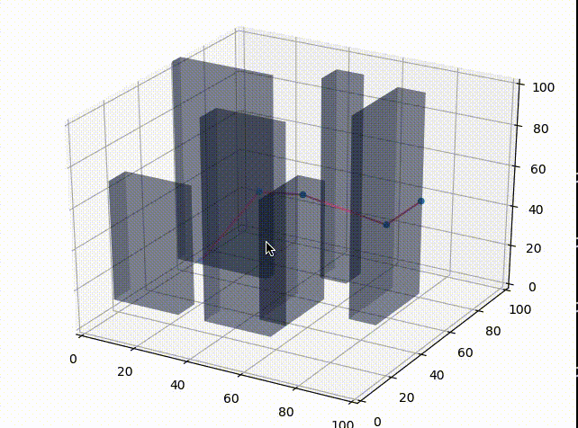

## Informed RRT*

Informed RRT* to plan a collision free path from start to goal position in an N-dimensional Map.

### Dependencies
- numpy, matplotlib, rtree-linux

### Usage example
```python
import numpy as np
from PathPlanning import RRTStar, Map
np.random.seed(7)

# 3D boxes   lx, ly, lz, hx, hy, hz
obstacles = [[-5, 25, 0, 20, 35, 60],
             [30, 25, 0, 55, 35, 100],
             [45, 35, 0, 55, 60, 60],
             [45, 75, 0, 55, 85, 100],
             [-5, 65, 0, 30, 70, 100],
             [70, 50, 0, 80, 80, 100]]

# limits on map dimensions
bounds = np.array([0,100])
# create map with obstacles
mapobs = Map(obstacles, bounds, dim = 3)

#plan a path from start to goal
start = np.array([90,60,60])
goal = np.array([20,40,20])

rrt = RRTStar(start = start, goal = goal,
              Map = mapobs, max_iter = 500,
              goal_sample_rate = 0.1)

waypoints, min_cost = rrt.plan()

#plot the waypoints and obstacles
rrt.draw_scene(waypoints, ax)
```


more in [examples.ipynb](./examples.ipynb)

### Future Work

- Improve running time and overall performance
- Implement other Path-Planning algorithms.

### References
- [Motion Planning as Search - Russ Tedrake](http://underactuated.csail.mit.edu/planning.html#section2)

Feel free to contribute to any part of the code.
